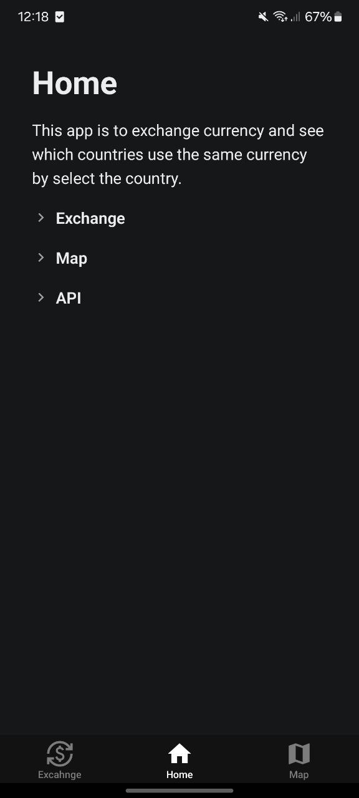
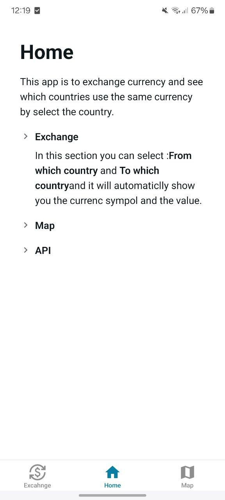
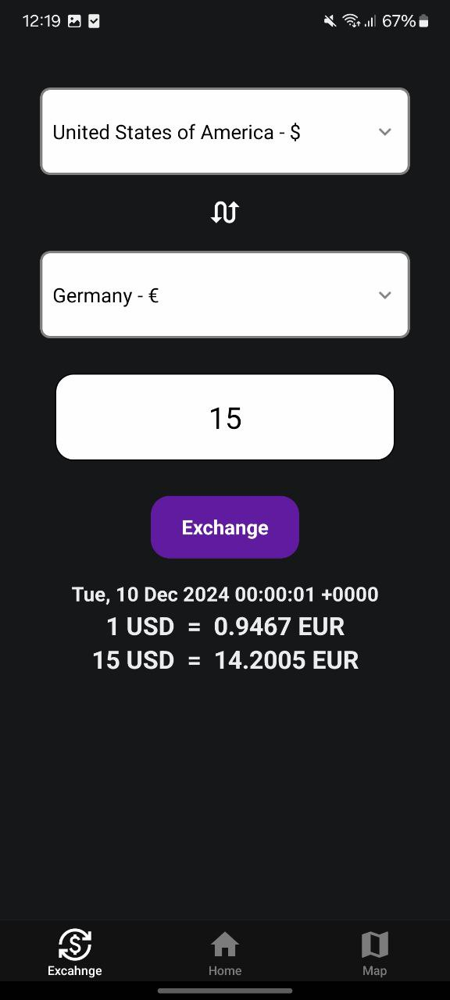
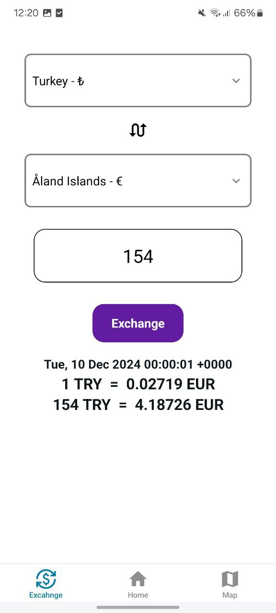
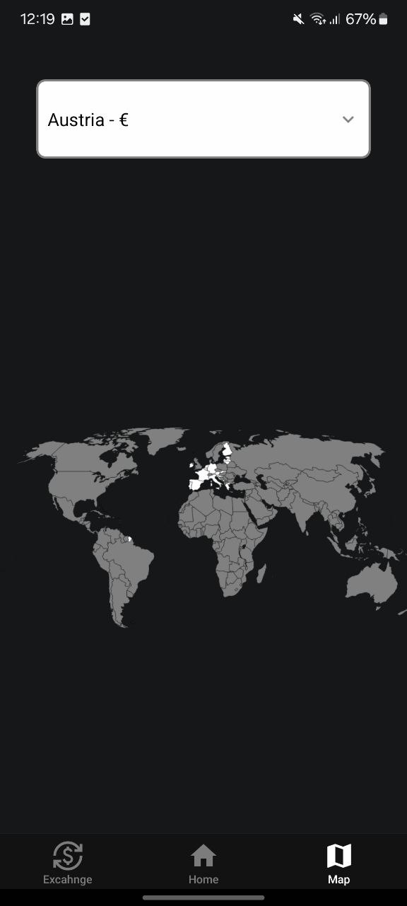
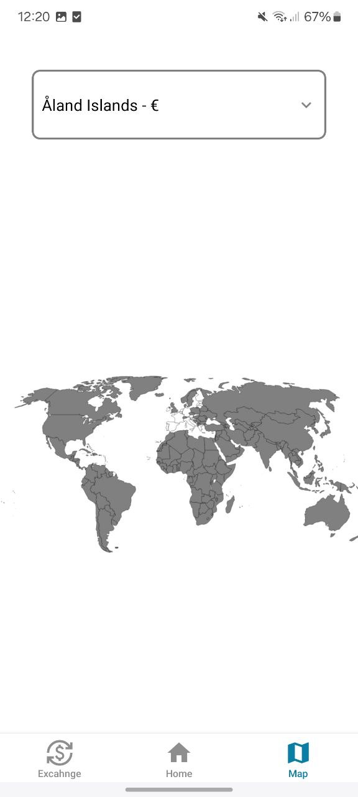

# 💱 Exchange

## Description

Andriod app to exchange money from any currency to any currency.

## Usage

1. Clone the project: `git clone git@github.com:Ghayth-Sabeaallil/exchange-app.git`
2. install npm packages: `npm install`
3. Start app:
   - Start: `npm run start`
4. Run the app on your own mobile or on andriod emulator

## Functions

- Select the currency From/To.
- Switch between them.
- See how it cost 1 Currency or write down how much you want to exchange.
- Show a map of the whole world, by selecting a country it will show you all countries that use the same currency

## API

For this project I have used API to get data
[text](https://www.exchangerate-api.com/docs/overview)

## 🖼️ Images

# 👨‍💻 Author

- Ghayth Sabeaallil - Developer and project owner.
